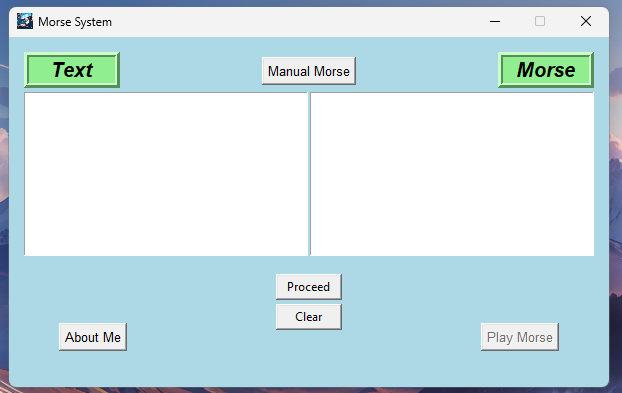
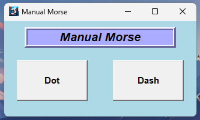
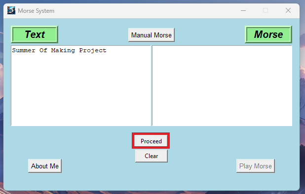
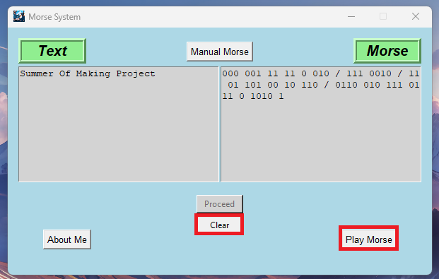
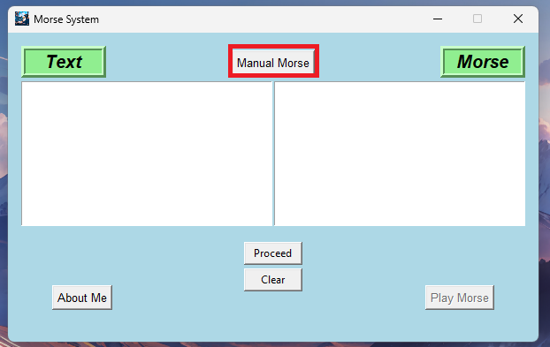

## Banner
<pre>
   _____ _    _ _____   __  __                        _____          _         _____           _                 
  / ____| |  | |_   _| |  \/  |                      / ____|        | |       / ____|         | |                
 | |  __| |  | | | |   | \  / | ___  _ __ ___  ___  | |     ___   __| | ___  | (___  _   _ ___| |_ ___ _ __ ___  
 | | |_ | |  | | | |   | |\/| |/ _ \| '__/ __|/ _ \ | |    / _ \ / _` |/ _ \  \___ \| | | / __| __/ _ \ '_ ` _ \ 
 | |__| | |__| |_| |_  | |  | | (_) | |  \__ \  __/ | |___| (_) | (_| |  __/  ____) | |_| \__ \ ||  __/ | | | | |
  \_____|\____/|_____| |_|  |_|\___/|_|  |___/\___|  \_____\___/ \__,_|\___| |_____/ \__, |___/\__\___|_| |_| |_|
                                                                                      __/ |                      
                                                                                     |___/                       

</pre>


# GUI Morse Code System
GUI Morse Code System is a Python based Project which can read and write Morse code from text and even transmit them through sound and Manual Morse coding is also Available. Also as it is an GUI Project so it will be Easy to Use.

Aim of the project is to make Morse Encoding and Decoding Easy for Beginners.


## About
* Created By HK (Harsh Khandal) Hacker
* Dated on 25/06/2025
* Language Python3
* Link: https://github.com/Hk-Hacker-Harsh/GUI_Morse_Code_System

## Installation
* Clone Github Repo
* Install Python3
* Check if all Libraries installed or not. If not use requirements.txt file.
Run : ```pip install -r requirements.txt```
* Run the .py file.

## Requirements
Python3
Libraries:
 * pip install tkinter
 * pip install winsound
 * pip install time
 * pip install webbrowser

## Contact:
* [Twitter](https://x.com/Hk__Hacker)
* [Github](https://github.com/Hk-Hacker-Harsh)


The program uses following Libraries:
    - Tkinter : For Graphical View
    - Time : For Current Date (Used when saving Output to a File)
    - Webbrowser : To open external Links in browser (About me section)
    - Winsound : To procude beep sounds for Dots and Dashs.

## Images:



## How To Use:
1. Install All the Required Libraries and Start the Program.


2. Input Text you want to Convert to Morse and Click the Proceed Button.


3. It will Converted to Morse. (Here 1s represents - (Dash) & 0s represents . (Dot))
Now you can click "Play Morse" to play morse sound or click "Clear" to Convert another Text or click "About Me" to learn More about me.


4. If you are a Nerd, and knows all morse codes and wanted to use it in Manual Mode, Click "Manual Morse".


5. It will open a New Window with two options "Dot" and "Dash", Dot will make sound of Short Beep, while Dash make sound of Long Beep.


## Demo Video : [Demo Video](/Demo/Demo.mp4)
## EXE File : [Exe File](/Demo/GUI_Morse_Code_System.exe)

## 🤝 Contributing

Wanna improve it or fix a bug?

1. Fork the repo
2. Create a new branch (`git checkout -b feature-name`)
3. Commit your changes
4. Open a pull request ✅

I'm always open to fresh ideas!


### License : Free and Open source (FOSS) for all and everyone. MIT icense.